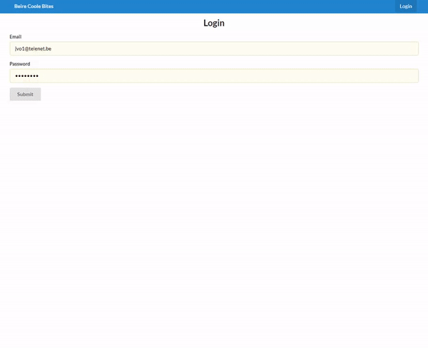

# [BeireCooleBites](http://dieterdeschrijver.be/) (WEBIV PROJECT 2020)

BeireCooleBites is a web application designed for people who want to register online for the BeireCooleBites week. It is an initiative by Beire Cool where they sell lunch to the benefit of 'De Warmste Week'.

Not only this but the application includes a fully functional managing platform for all the days and menus.



## Getting Started

### Beforehand
* Run the backend side of the web application

### Prerequisites

* You should have [npm](https://www.npmjs.com/get-npm) installed on your machine. 

### Installing

* Clone the repository:
```
git clone https://github.com/Web-IV/1920-a1-fe-DieterDeSchrijver.git
```

* Install dependancies:
```
npm install
```
* Run the app in:
```
npm start
```
* Open [http://localhost:4200/](http://localhost:4200/) to view the page in your browser.

## Author

This project was started by [Dieter De Schrijver](https://github.com/DieterDeSchrijver)

## Built with

* [Angular](https://github.com/angular) - The web framework used
* [Semantic-ui](https://react.semantic-ui.com/) - Styling framework
